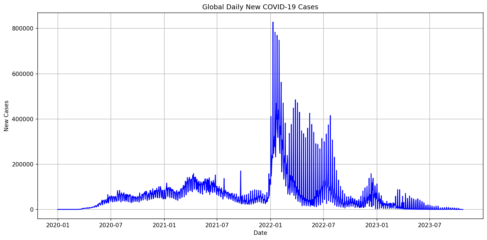
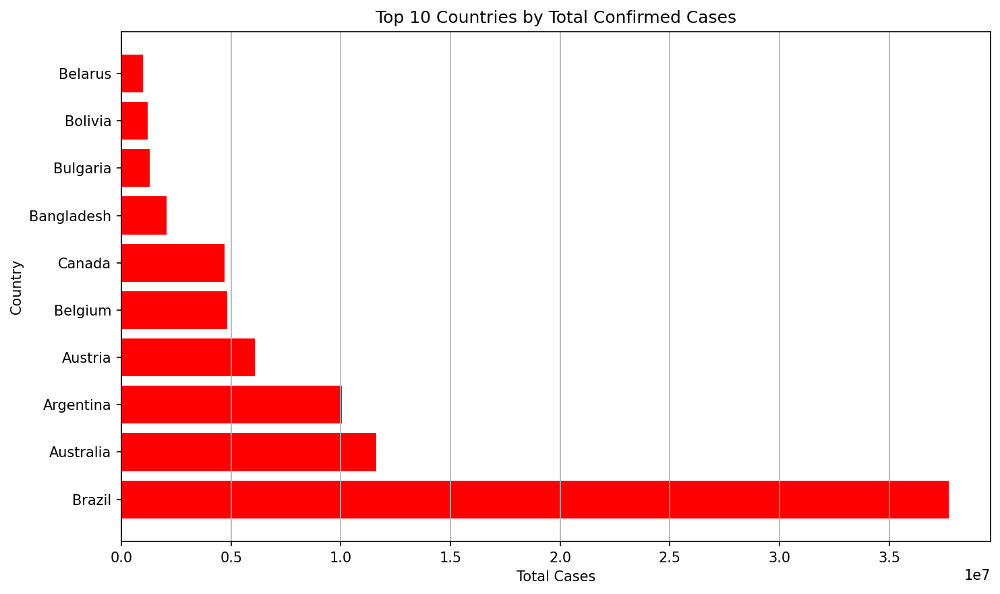
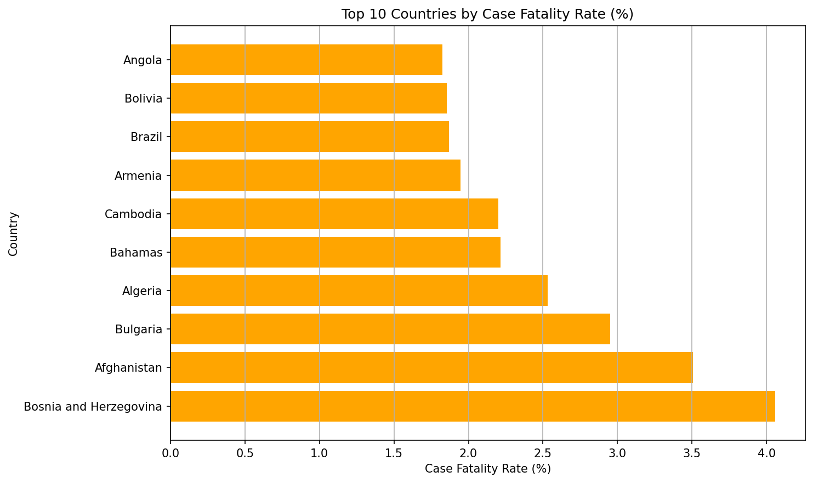
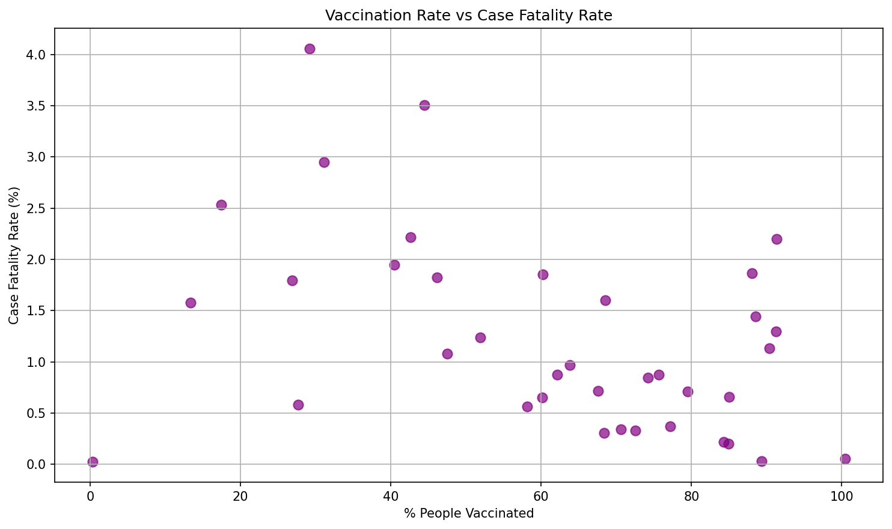
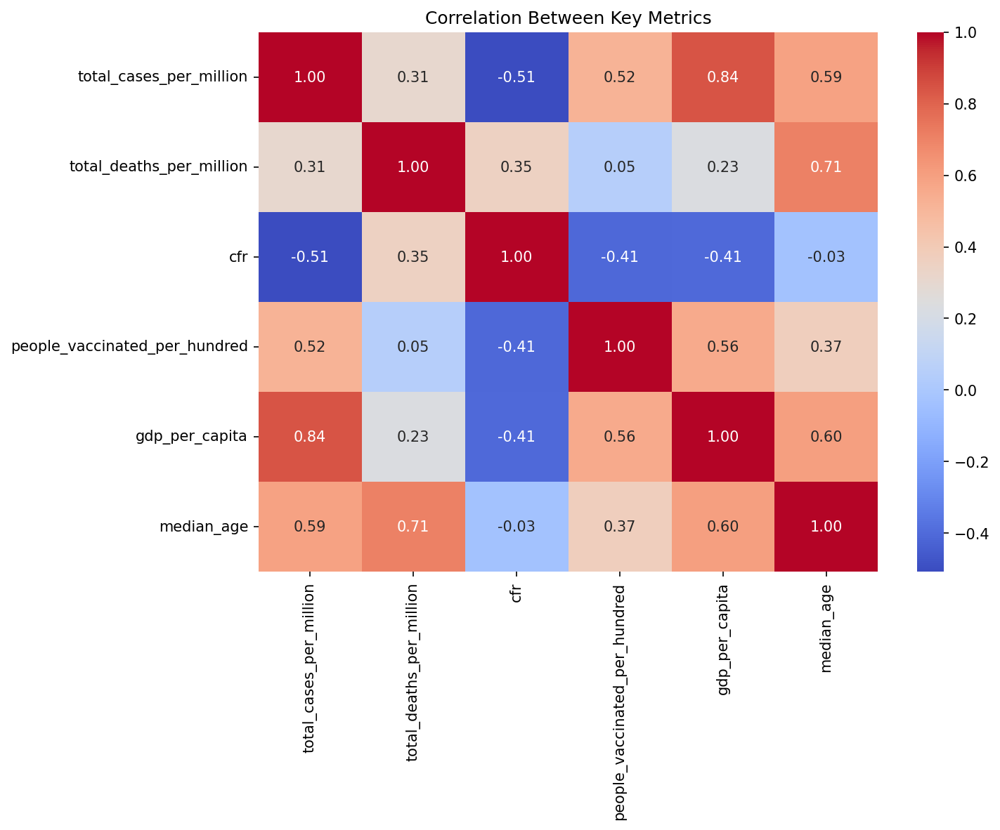

# COVID-19 Global Data Analysis & Visualization

   

**End-to-end analysis of global COVID-19 data (Jan 2020 – Oct 2023) · 237 countries · 326,222 rows**

---

## Key Questions Investigated

1. How did global COVID-19 cases evolve across waves from 2020 to 2023?
2. Which countries were hit hardest — by total cases and by death rate?
3. Did higher vaccination rates actually reduce fatality?
4. What do GDP, median age, and vaccination tell us about why some countries fared worse?

---

## Key Findings

### Global Trend
The global daily new cases curve shows clear distinct waves from January 2020 to October 2023. Peak single-day global cases exceeded **800,000 new cases**, with each wave corresponding to known variant periods (Alpha, Delta, Omicron), followed by declines due to interventions and rising vaccination.

### Top Countries by Total Cases
| Rank | Country | Total Cases | Total Deaths | CFR |
|---|---|---|---|---|
| 1 | United States | 103.4 million | 1.13 million | 1.10% |
| 2 | China | 99.3 million | 121,742 | 0.12% |
| 3 | India | 45.0 million | 532,037 | 1.18% |
| 4 | France | 39.0 million | 167,985 | 0.43% |
| 5 | Germany | 38.4 million | 174,979 | 0.46% |
| 6 | Brazil | 37.7 million | 704,659 | 1.87% |

> China's low CFR (0.12%) vs USA's (1.10%) despite similar case counts reflects major differences in reporting methodology, not just healthcare outcomes.

### Case Fatality Rate — The Harder Story
Countries with the highest CFR were not always the ones with the most cases. Angola, Bolivia, Brazil, Armenia, Cambodia, and Afghanistan led with CFRs ranging from **~1.5% to 4%**. This reflects healthcare system strain and limited testing capacity — not just case severity.

### Vaccination vs Death Rate
**Clear negative trend found:** Countries with vaccination rates above 60–80% consistently showed CFR below 2–2.5%. Low-vaccination countries showed high and scattered CFR values. Higher vaccination significantly reduced deaths even when it didn't prevent infection entirely.

### Correlation Heatmap — What Actually Drives Outcomes
| Variable Pair | Correlation | Interpretation |
|---|---|---|
| GDP per capita ↔ Cases per million | **+0.84** | Wealthier countries reported more cases — likely due to better testing infrastructure |
| Median age ↔ Deaths per million | **+0.71** | Older populations faced significantly higher death rates |
| Vaccination rate ↔ CFR | **−0.41** | Higher vaccination = lower fatality, clean negative relationship |
| CFR ↔ Median age | **−0.03** | Age alone doesn't drive CFR once healthcare and testing factors are accounted for |

---

## Project Structure

```
covid19-analysis/
├── Covid19_EDA.ipynb          # EDA & data cleaning notebook
├── covid19_visualization.ipynb    # Visualization notebook
├── owid-covid-data.csv.zip    # Raw dataset (Our World in Data)
├── cleaned_data.csv           # Cleaned output (generated by EDA notebook)
└── README.md
```

---

## What's Inside

### Notebook 1 — EDA & Cleaning (`Covid19_EDA.ipynb`)

**Dataset:** 350,085 rows × 67 columns before cleaning → 326,222 rows × 70 columns after

| Issue Found | Fix Applied |
|---|---|
| Missing values in new_cases, new_deaths | Filled with 0 (no data = no report, not null) |
| Missing cumulative columns | Forward-filled within each country group |
| Negative new case values | Clipped to 0 using `.clip(lower=0)` |
| Decreasing cumulative totals | Re-applied forward fill on sorted data |
| 11,114 single-day reporting spikes | Flagged using 7-day rolling average (5× threshold) |
| Aggregate rows (World, Asia, Europe etc.) | Removed using OWID iso_code prefix filter |
| Date column stored as object | Converted to `datetime64` |

**Key EDA finding:** 20 countries had zero vaccination data — identified as territories that report under a parent country, not a data error.

### Notebook 2 — Visualizations  (`covid19_visualization.ipynb`)

| Visualization | Type | Tool |
|---|---|---|
| Global daily new cases trend | Line chart | Matplotlib |
| Top 10 countries by total cases | Horizontal bar | Matplotlib |
| Top 10 countries by CFR | Horizontal bar | Matplotlib |
| Vaccination rate vs CFR | Scatter plot | Matplotlib |
| Correlation heatmap | Heatmap | Seaborn |
| COVID spread over time | Animated choropleth | Plotly |
| Top 15 countries race over time | Bar chart race | Plotly |

---

## Visualizations

### Global Daily New Cases Trend


### Top 10 Countries by Total Cases


### Top 10 Countries by Case Fatality Rate


### Vaccination Rate vs Case Fatality Rate


### Correlation Heatmap


---

## Data Cleaning Highlights

**Dataset:** [Our World in Data – COVID-19 (Kaggle)](https://www.kaggle.com/datasets/caesarmario/our-world-in-data-covid19-dataset)

- 350,085 raw rows across 237 countries spanning Jan 2020 – Oct 2023
- CFR recalculated from scratch after cleaning to avoid division-by-zero errors
- Spike detection using 7-day rolling average — 11,114 anomalous single-day dumps flagged
- Aggregate geographic regions (World, Asia, Europe etc.) removed to avoid double-counting

---

## Libraries Used

| Library | Purpose |
|---|---|
| `pandas`, `numpy` | Data loading, cleaning, transformation |
| `matplotlib`, `seaborn` | Static charts and heatmaps |
| `plotly` | Interactive choropleth and bar chart race |
| `geopandas` | World map GeoJSON for choropleth |

---

## How to Run

```bash
# Step 1 — Run EDA notebook first (generates cleaned_data.csv)
jupyter notebook Covid19_EDA.ipynb

# Step 2 — Run visualization notebook
jupyter notebook covid19_visualization.ipynb
```

> Make sure `owid-covid-data.csv.zip` is in the root folder before running.

---

## Conclusion

This project confirmed three things with data:

**1.** Vaccination worked — countries above 60% vaccination showed consistently lower fatality rates, visible in both the scatter plot and correlation matrix.

**2.** Wealth ≠ safety, but wealth = better reporting — the 0.84 correlation between GDP and cases per million is not because rich countries got sicker, but because they tested more and reported more accurately.

**3.** Age matters more than most factors for deaths — the 0.71 correlation between median age and deaths per million held even after removing data quality issues, making demographic vulnerability a stronger predictor than healthcare spending alone.

---

*Data Analytics Project · Avika · May 2026*
